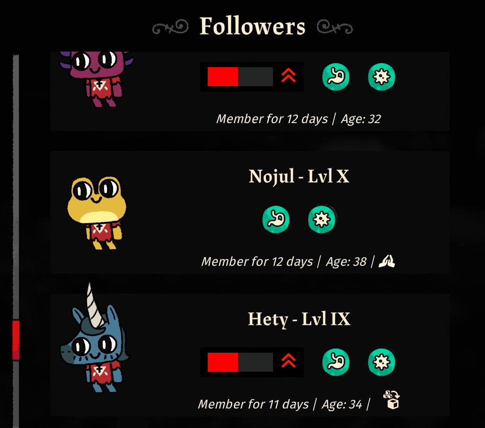

**Show Follower Job Titles** is a [Cult of the Lamb]() mod that displays a follower's current job with its respective icon. 

## Features

The total count of followers with a specific job will be listed next to the job title. The `+ 1` means that if you assign the follower
that specific job, there will be a total of `n + 1` followers with the job.

In the case of the image below, assigning this follower the `Worship` job would mean that there will be `9 + 1 = 10` total worshippers.

The name of the follower's current job will be highlighted in yellow. Most of the job icons will also be highlighted in yellow,
but some might not be highlighted (lumberjack and miner, for example).

The job icon should be shown in most situations, including follower lists.

